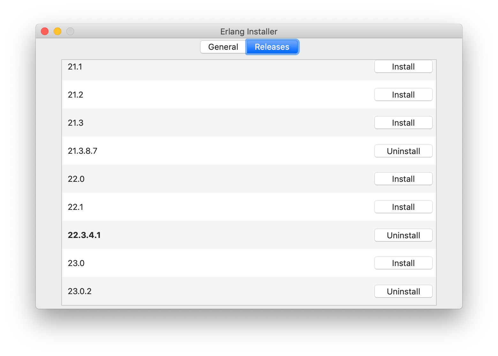
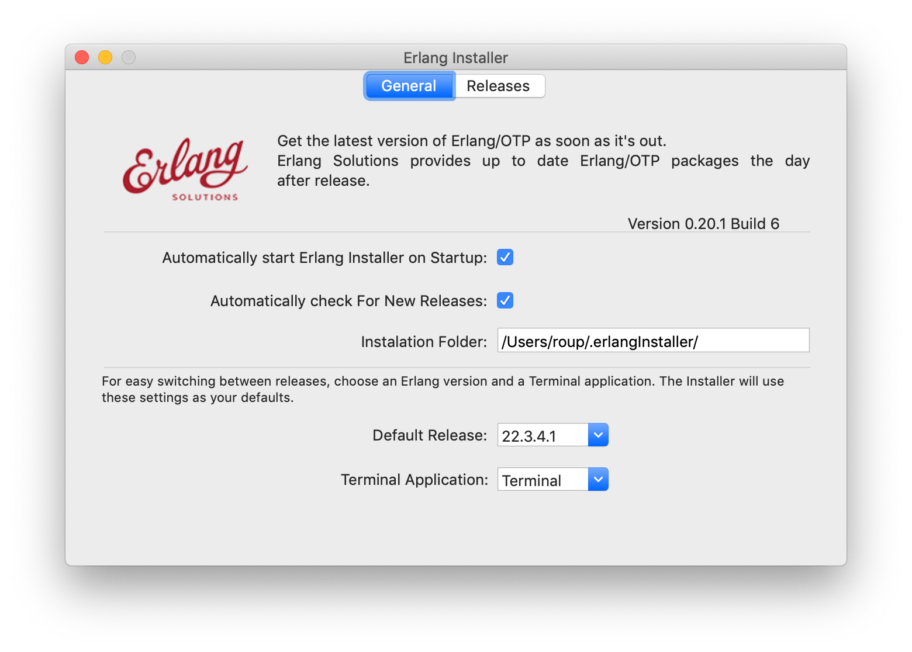
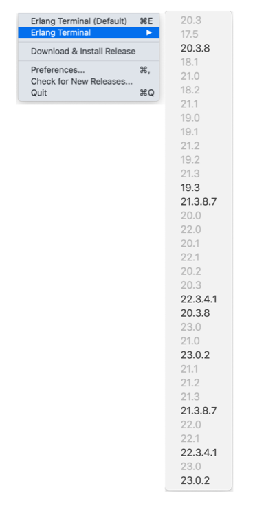

=====================================================
About the Erlang Programming Language and Environment
=====================================================

:Home page: https://github.com/pierre-rouleau/about-erlang
:Time-stamp: <2020-07-05 12:37:47, updated by Pierre Rouleau>
:Copyright: Copyright © 2020 by Pierre Rouleau
:License: `MIT <LICENSE>`_

This document is a top level view of Erlang and its environment; it provides
overviews and links to important resources.
It is a work in progress and will evolve over time.
Any suggestion and contribution are welcome!

.. contents::  **Table Of Contents**
.. sectnum::

Learning Erlang
===============

======================================================= ===============================================================
Topic                                                   Comment
======================================================= ===============================================================
**Authority**
`Erlang Project Homepage`_                              Erlang/OTP project home page.
                                                        They control all official releases, provide
                                                        the official implementation, documentation,
                                                        tools and reference to important books and
                                                        documents.

`Erlang On-Line Documentation, Books & Papers`_         Official documentation about Erlang and OTP with links to
                                                        books and `Joe Armstrong`_ paper.  This includes:

                                                        - `Erlang/OTP Documentation`_ (latest official version)
                                                        - `Erlang/OTP Documentation with Search`_ (works in Chrome,
                                                          Firefox 74.0.1 but not in Safari 13.1).
                                                        - `Erlang/OTP FAQ`_
                                                        - erldocs.com_, an alternative to the official Erlang
                                                          documentation.
                                                        - `Erlang Reference Manual - User's Guide`_
                                                        - `Efficiency Guide - User's Guide`_
                                                        - `Systems Principles - User's Guide`_
                                                        - `OTP Design Principles - User's Guide`_
                                                        - `OTP Versions Tree`_

`Erlang Community`_                                     Erlang.org page listing, among other things:

                                                        - Erlang Development repositories  (see below)
                                                        - Erlang IDE and editor support
                                                        - Free online courses
                                                        - Erlang Tutorials
                                                        - Mailing Lists
                                                        - Chat
                                                        - StackOverflow Q&A
                                                        - Erlang Resources

**Erlang GitHub Repositories**
`Erlang @ Github`_                                      Holds the official Erlang repositories:

                                                        - `Erlang/OTP @ Github`_
                                                        - `Erlang/Erlang-org @ Github`_ (the Erlang website)
                                                        - `Erlang/rebar3 @ Github`_
                                                        - `Erlang/docker-erlang-otp @ Github`_ (the Official Erlang OTP
                                                          image on Docker Hub)
                                                        - `Erlang/cd @ Github`_ (continuous delivery of Erlang/OTP artifacts)
                                                        - `Erlang/EEP @ Github`_  (Erlang Enhancement Proposals)
                                                        - and several others...

**Erlang Software License**                             As explained in the `Wikipedia Erlang Public License`_ page,
                                                        Ericsson has changed the license under which Erlang is
                                                        published as of Erlang/OTP version 18.0.
Erlang/OTP 18.0 and later: `Apache License 2.0`_
Erlang/OTP prior to 18.0: `Erlang Public License`_

**Erlang Sites: References**
`Erlang (programming language) @ Wikipedia`_            Outsider's view of the Erlang programming language with some
                                                        history, language overview  and several links to interesting
                                                        articles and sites.
`Category:Erlang (programming language) @ Wikipedia`_   Links to Wikipedia pages related to Erlang and its libraries.

**Erlang Sites: Books**
`Erlang Books @ Erlang Central`_

**Erlang Devoted Sites**
`Erlang Central`_ - Erlang Community                    A community of Erlang developers with links to documentation,
                                                        books and several packages and libraries.

`Erlang Solutions`_                                     An organization devoted to Erlang based software solutions,
                                                        which provides design services but also provides open source
                                                        and pre-package Erlang installations.

`Spawned Shelter`_                                      A collection of articles, videos and books for learning Erlang,
                                                        and other BEAM languages like Elixir, LFE and EFene.
**Erlang Build/Install Tools**
Homebrew_                                               Install pre-built version of Erlang.
`Erlang Solutions`_ ErlangInstaller_                    Install pre-built versions of Erlang with macOS GUI
                                                        application ErlangInstaller_ froom `Erlang Solutions`_.
kerl_                                                   Easy building and installing of Erlang/OTP from source.
asdf-vm_                                                Package manager - can install Erlang, Elixir and other
                                                        systems from source.

**Erlang Libraries**
`Erlang Libraries @ Erlang.org`_                        Describes what is an Erlang OTP library.

`Awesome Erlang`_                                       A curated list of amazingly awesome Erlang libraries.

======================================================= ===============================================================

.. _Erlang Project Homepage:                      https://www.erlang.org
.. _Erlang On-Line Documentation, Books & Papers: https://www.erlang.org/docs
.. _Joe Armstrong:                                https://en.wikipedia.org/wiki/Joe_Armstrong_(programmer)
.. _Erlang/OTP Documentation:                     https://erlang.org/doc/
.. _Erlang/OTP Documentation with Search:         https://erlang.org/doc/search/
.. _erldocs.com:                                  https://erldocs.com/
.. _Erlang Reference Manual - User's Guide:       https://erlang.org/doc/reference_manual/users_guide.html
.. _Efficiency Guide - User's Guide:              https://erlang.org/doc/efficiency_guide/users_guide.html
.. _Systems Principles - User's Guide:            https://erlang.org/doc/system_principles/system_principles.html
.. _OTP Design Principles - User's Guide:         https://erlang.org/doc/design_principles/users_guide.html
.. _OTP Versions Tree:                            https://erlang.org/download/otp_versions_tree.html
.. _Erlang/OTP FAQ:                               http://erlang.org/faq/faq.html
.. _Erlang Community:                             https://www.erlang.org/community
.. _Erlang Books @ Erlang Central:                https://erlangcentral.org/books/
.. _Erlang (programming language) @ Wikipedia:    https://en.wikipedia.org/wiki/Erlang_(programming_language)
.. _Category\:Erlang (programming language) @ Wikipedia: https://en.wikipedia.org/wiki/Category:Erlang_(programming_language)
.. _Apache License 2.0:                           https://en.wikipedia.org/wiki/Apache_License
.. _Erlang Public License:                        https://www.erlang.org/EPLICENSE
.. _Wikipedia Erlang Public License:              https://en.wikipedia.org/wiki/Erlang_Public_License
.. _Erlang Central:                               https://erlangcentral.org/
.. _Erlang Solutions:                             https://www.erlang-solutions.com
.. _Erlang @ Github:                              https://github.com/erlang
.. _Erlang/OTP @ Github:                          https://github.com/erlang/otp
.. _Erlang/Erlang-org @ Github:                   https://github.com/erlang/erlang-org
.. _Erlang/rebar3 @ Github:                       https://github.com/erlang/rebar3
.. _Erlang/docker-erlang-otp @ Github:            https://github.com/erlang/docker-erlang-otp
.. _Erlang/cd @ Github:                           https://github.com/erlang/cd
.. _Erlang/EEP @ Github:                          https://github.com/erlang/eep
.. _kerl:                                         https://github.com/kerl/kerl
.. _asdf-vm:                                      https://asdf-vm.com/#/
.. _Erlang Libraries @ Erlang.org:                http://erlang.org/faq/libraries.html
.. _Awesome Erlang:                               https://github.com/drobakowski/awesome-erlang
.. _Spawned Shelter:                              https://spawnedshelter.com

-----------------------------------------------------------------------------

Installing Erlang
=================

Erlang can be installed from source or from pre-built packages.

Instruction on how to install Erlang depends on the Operating System and are
available on the `Erlang OTP Download page`_.  Another good source of
information is available in the `setup section of the Adopting Erlang`_ web site.

The following section describes the various ways to install Erlang on macOS.

.. _setup section of the Adopting Erlang: https://adoptingerlang.org/docs/development/setup/

Installing Erlang on macOS
--------------------------

To install Erlang on your macOS system you can use one of the following ways:

#. `Using Homebrew`_, the simplest to get going, but also the least flexible way.
   A good first step for experimentation.
#. `Using Erlang Installer from Erlang Solutions`_.  With Erlang Solutions'
   ``ErlangInstaller`` macOS native application you can quickly install
   pre-built versions of Erlang for macOS and select which one you want to
   use.  I provide extra information on how to extends this.
#. `Using Kerl`_ to build from source code using clones of the official Erlang
   git repositories.
#. `Using asdf-vm`_ to build from source.  asdf-vm extends Kerl and provide
   the ability to build lots of other tools, Elixir for instance.
   At the moment (and from what I currently know) this seems to be a very good
   choice because you can install Erlang but also Elixir and several other
   tools with it.
#. Building from source using the Erlang/OTP instructions found in
   the `Erlang/OTP Build and Install instructions`_. I have not yet gone
   through the entire process yet. Once I do I will provide more information.

.. _Erlang/OTP Build and Install instructions: https://github.com/erlang/otp/blob/master/HOWTO/INSTALL.md

Also, see the section titled
`Manual installation of Erlang OTP Documentation and Man Files`_
to get a local copy of Erlang HTML documentation and Erlang Man pages.

Some extra information specific to macOS is available of my `macOS Development Environment`_ document.

.. _Installing Erlang on macOS: https://github.com/pierre-rouleau/about-macOS/blob/master/doc/macos-env.rst#environment-for-erlang
.. _Erlang OTP Download page:   https://www.erlang.org/downloads
.. _macOS Development Environment: https://github.com/pierre-rouleau/about-macOS/blob/master/doc/macos-env.rst

Using Homebrew
~~~~~~~~~~~~~~

Homebrew_ is a popular package manager for macOS (and now also for Linux).  It
is very easy to install Erlang with Homebrew.  However, Homebrew installs a
version that it will eventually want to upgrade.  It is fine when just
experimenting with Erlang but this will not help you if you want to create a
system that will be running for a long time.

- First, install the Homebrew command line utility (``brew``)using the
  instructions right on the `Homebrew home page`_.
- You can then use the various commands:

  - ``brew search`` to search for a package.  For Erlang: ``brew search
    erlang`` will do.
  - ``brew info`` to get more info about a package. Something like ``brew info
    erlang``.  This will describe the version and its dependencies.
  - ``brew install`` to install a given package.  To install Erlang with
    Homebrew, the command is: ``brew install erlang``.

For example:

.. code:: shell

    > brew search erlang
    ==> Formulae
    erlang ✔                   erlang@20                  erlang@21                  erlang@22
    > brew info erlang
    erlang: stable 23.0.2 (bottled), HEAD
    Programming language for highly scalable real-time systems
    https://www.erlang.org/
    /usr/local/Cellar/erlang/22.3.4 (5,790 files, 282MB) *
      Poured from bottle on 2020-05-12 at 14:53:10
    From: https://github.com/Homebrew/homebrew-core/blob/HEAD/Formula/erlang.rb
    ==> Dependencies
    Build: autoconf ✔, automake ✔, libtool ✘
    Required: openssl@1.1 ✔, wxmac ✘
    ==> Options
    --HEAD
            Install HEAD version
    ==> Caveats
    Man pages can be found in:
      /usr/local/opt/erlang/lib/erlang/man

    Access them with `erl -man`, or add this directory to MANPATH.
    >

You'll probably want to put the directory where Homebrew places all binaries
in your path.  This way you'll be able to invoke these tools without a
path. The Erlang binary is placed in the same directory.  This means that the
Homebrew-installed version of Erlang will be available to the shell
directly. But not the Erlang Man pages.

On my systems I like to be able to have quick commands to setup shells.
I write a shells script that is meant to be sourced and then I write a shell
alias to source it.  I can then have various commands that setup the shell to
what I want and I can save all of this logic in a VCS.

For a Bash shell, for a Homebrew-installed Erlang, all that needs to be done
is to setup the MANPATH shell variable.  I also setup a shell variable to
prevent multiple execution and add a title to the top of my terminal window.

Here's a copy of the script that I named ``envfor-erlang-22.3.4`` store it in
a directory that's on my system's PATH and made executable:

.. code:: bash

    #!/usr/bin/env bash
    # Abstract: Complete Homebrew system Erlang 22.3.4
    # Last Modified Time-stamp: <2020-07-02 23:32:18, updated by Pierre Rouleau>
    #
    # This file *must* be sourced.
    #
    # Run with:  use-erlang
    #
    if [ "$DIR_ERLANG_DEV" == "" ]; then
        export DIR_ERLANG_DEV="$HOME/dev/erlang"
        MANPATH=/usr/local/Cellar/erlang/22.3.4/lib/erlang/man:`manpath`
        export MANPATH
        echo "+ Erlang 22.3.4 environment set."
        echo "+ Using Cellar/Erlang/22.3.4 Man pages."
        settitle "Erlang 22.3.4 HB"
    else
        echo "! Erlang environment was already set for this shell: nothing done this time."
    fi

The ``settitle`` is another quick shell script that sets the terminal title:

.. code:: shell

    #!/bin/sh
    # Abstract: Set the title of the current Terminal window.
    echo "\033]0;${1}\007\c"

The ``.bashrc`` file holds the alias:

.. code:: bash

   alias use-erlang='source envfor-erlang-22.3.4'

To use it I start a new Bash shell and type ``use-erlang``, as shown here:

.. code:: bash

    > use-erlang
    + Erlang 22.3.4 environment set.
    + Using Cellar/Erlang/22.3.4 Man pages.
    > echo $MANPATH
    /usr/local/Cellar/erlang/22.3.4/lib/erlang/man:/usr/local/share/man:/usr/share/man:/opt/X11/share/man:/Library/Developer/CommandLineTools/SDKs/MacOSX.sdk/usr/share/man:/Applications/Xcode.app/Contents/Developer/usr/share/man:/Applications/Xcode.app/Contents/Developer/Toolchains/XcodeDefault.xctoolchain/usr/share/man
    > man man
    > man -w erl
    /usr/local/Cellar/erlang/22.3.4/lib/erlang/man/man1/erl.1
    > man -w lists
    /usr/local/Cellar/erlang/22.3.4/lib/erlang/man/man3/lists.3
    > version-erl
    22.3.4
    >

The version-erl is another script I wrote to display the version of the Erlang
system available in the shell.  It runs Erlang code from the command line:

.. code:: bash

    #!/usr/bin/env bash
    # Abstract: print version of currently available Erlang on stdout
    # -----------------------------------------------------------------------------
    erl -eval '{ok, Version} = file:read_file(filename:join([code:root_dir(), "releases", erlang:system_info(otp_release), "OTP_VERSION"])), io:fwrite(Version), halt().' -noshell
    # -----------------------------------------------------------------------------

.. _Homebrew home page:
.. _Homebrew: https://brew.sh

Using Erlang Installer from Erlang Solutions
~~~~~~~~~~~~~~~~~~~~~~~~~~~~~~~~~~~~~~~~~~~~

`Erlang Solutions`_ provide a macOS application called the Erlang Installer that allows the
installation of several versions of Erlang on a macOS computer.  You can get
that tool on `Erlang Solution Download page`_.  Select Erlang OTP and the Mac
OS X platform and you should get a link to ErlangInstaller.1.0.2.dmg_ or
something more recent.

With this GUI tool you can install or remove several pre-compiled versions of Erlang for
macOS.

With the Preferences dialog of ErlangInstaller, you can select one version you
can use by default, specify the directory where the application stores its
files and identify the application used for launching shells.

When the ErlangInstaller application runs, it show up in macOS menu bar you
can quickly open its Preference dialog to manage Erlang versions and also use
the menu to launch a shell specialized with the default Erlang version or any
of the Erlang versions you have installed.

The latest version of this tool installs all versions under the
``~/.erlanginstaller`` root (but that can be changed via the Preference
dialog),
along with a JSON file that contains a list of
available versions and a symlink to the version you identify as a default via
the ErlangInstaller application Preference dialog.

Here's what the top level view of the ``~/.erlanginstaller`` directory looks
like:

.. code:: shell

    > tree -L 1 -A .erlanginstaller
    .erlanginstaller
    ├── 19.3
    ├── 20.3.8
    ├── 21.3.8.7
    ├── 22.3.4.1
    ├── 23.0.2
    ├── available-releases.json
    └── default -> /Users/roup/.erlangInstaller/22.3.4.1

    6 directories, 1 file
    >

Here again, listing only the directories at a depth of 2, with the Erlang
versions I had installed at the time.

.. code:: shell

    >
    > tree -d -L 2 -A .erlanginstaller
    .erlanginstaller
    ├── 19.3
    │   ├── bin
    │   ├── erts-8.3
    │   ├── lib
    │   ├── misc
    │   ├── releases
    │   └── usr
    ├── 20.3.8
    │   ├── bin
    │   ├── erts-9.3.3
    │   ├── lib
    │   ├── misc
    │   ├── releases
    │   └── usr
    ├── 21.3.8.7
    │   ├── bin
    │   ├── erts-10.3.5.5
    │   ├── lib
    │   ├── misc
    │   ├── releases
    │   └── usr
    ├── 22.3.4.1
    │   ├── bin
    │   ├── erts-10.7.2.1
    │   ├── lib
    │   ├── misc
    │   ├── releases
    │   └── usr
    ├── 23.0.2
    │   ├── bin
    │   ├── doc
    │   ├── erts-11.0.2
    │   ├── lib
    │   ├── misc
    │   ├── releases
    │   └── usr
    └── default -> /Users/roup/.erlangInstaller/22.3.4.1

    37 directories
    >

With this application you can install or removed versions of Erlang easily.

Their Erlang implementations work fine but the HTML documentation and the Man pages
are missing.  You must install these files separately.
See the section titled
`Manual installation of Erlang OTP Documentation and Man Files`_ which
describes how to do it.

I use the same strategy as for Homebrew here and I create shell scripts and
alias to activate the various Erlang versions instead of using the Erlang
Installer tool that can launch pre-configured shell with specific version of
Erlang.  The reason I do this is to add access to the Man pages and to setup
other things if I need to.  For example, I'm thinking of setting up my Emacs
environment to be able to access the local HTML documentation of a the
module:function:arity at the cursor location or on request.  For that I need
to identify the location of the root where the files are stored and I do this
with an environment variable that I could set in the script.

For Erlang versions installed with the Erlang Installer from Erlang Solutions
I use the ``-ei`` suffix to the script and alias names.  For example, here's
the alias and the script for Erlang 23.0.2 installed with the tool inside
``~/.erlanginstaller/23.0.2``:

The alias, stored inside ``.bashrc``:

.. code:: bash

    alias use-erlang-23-ei='source envfor-erlang-23-ei'

And the bash script file that is source by it, stored in a directory that is
on my system's path:

.. code:: bash

    #!/usr/bin/env bash
    # Abstract: Complete Erlang Solutions' Erlang Installer 23.0.2
    # Last Modified Time-stamp: <2020-07-02 19:18:12, updated by Pierre Rouleau>
    # -----------------------------------------------------------------------------
    # This file *must* be sourced.
    #
    # Run with: use-erlang-23-ei

    # -----------------------------------------------------------------------------
    if [ "$DIR_ERLANG_DEV" == "" ]; then
        export DIR_ERLANG_DEV="$HOME/dev/erlang"
        PATH=$HOME/.erlangInstaller/23.0.2/lib/erl_interface-4.0/bin:$HOME/.erlangInstaller/23.0.2/bin:${PATH}
        export PATH
        MANPATH=$HOME/docs/Erlang/otp-23.0/man/man:`manpath`
        export MANPATH
        echo "+ Erlang 23.0.2 (from Erlang Solutions Erlang Installer) environment set."
        echo "+ Using OTP-23.0 Man pages."
        settitle "Erlang 23.0.2 EI"
    else
        echo "! Erlang environment was already set for this shell: nothing done this time."
    fi

    # -----------------------------------------------------------------------------

To use this, I start a new shell and I issue the ``use-erlang-23-ei`` command:

.. code:: shell

    > use-erlang-23-ei
    + Erlang 23.0.2 (from Erlang Solutions Erlang Installer) environment set.
    + Using OTP-23.0 Man pages.
    > version-erl
    23.0.2
    > which erl
    /Users/roup/.erlangInstaller/23.0.2/bin/erl
    > man -w erl
    /Users/roup/docs/Erlang/otp-23.0/man/man/man1/erl.1
    > man -w lists
    /Users/roup/docs/Erlang/otp-23.0/man/man/man3/lists.3
    > erl
    Erlang/OTP 23 [erts-11.0.2] [source] [64-bit] [smp:8:8] [ds:8:8:10] [async-threads:1]

    Eshell V11.0.2  (abort with ^G)
    1> q().
    ok
    2>
    >
    >

.. _Erlang Solutions: https://www.erlang-solutions.com
.. _ErlangInstaller:
.. _Erlang Solution Download page: https://www.erlang-solutions.com/resources/download.html
.. _ErlangInstaller.1.0.2.dmg: https://packages.erlang-solutions.com/os-x-installer/ErlangInstaller1.0.2.dmg
.. _Erlang/OTP download: https://www.erlang.org/downloads

Manual installation of Erlang OTP Documentation and Man Files
~~~~~~~~~~~~~~~~~~~~~~~~~~~~~~~~~~~~~~~~~~~~~~~~~~~~~~~~~~~~~

I normally have a directory where I store the extra documentation files I
download from various sites.  Something like Python documentation, Erlang
documentation and Man files.  By having these files locally I can perform
search in the help files using my local tools and I can also integrate help
providing tools with my editor.  I avoid having to perform web requests
reducing my network traffic, my impact on overall energy consumption and
my dependence on being connected to the public Internet.

I download the OTP HTML documentation files and the Man page files from
the `Erlang/OTP download`_  page.  This page has a list of all Erlang/OTP
versions on the right hand side that leads to a version specific page where
you can download the documentation files as well as the source code archive and
the Windows binaries.

.. caution:: Be aware that the list of Erlang versions are on the right hand
             side of the `Erlang/OTP download`_ page but will show **only if
             your browser window is wide enough!**.

I normally store these files in the ``~/docs`` directory and rename the
directory extracted from the zip tarballs downloaded from the `Erlang/OTP
download`_ page.  Here's the content of one such directory tree, listed with
the tree command line utility, with a view limited to a depth of 3:

.. code:: shell

    > tree -d docs/Erlang -L 3 -A
    docs/Erlang
    ├── otp-17.5
    │   ├── html
    │   │   ├── doc
    │   │   ├── erts-6.4
    │   │   └── lib
    │   └── man
    │       └── man
    ├── otp-18.3
    │   ├── html
    │   │   ├── doc
    │   │   ├── erts-7.3
    │   │   └── lib
    │   └── man
    │       └── man
    ├── otp-19.3
    │   ├── html
    │   │   ├── doc
    │   │   ├── erts-8.3
    │   │   └── lib
    │   └── man
    │       └── man
    ├── otp-20.3
    │   ├── html
    │   │   ├── doc
    │   │   ├── erts-9.3
    │   │   └── lib
    │   └── man
    │       └── man
    ├── otp-21.3
    │   ├── html
    │   │   ├── doc
    │   │   ├── erts-10.3
    │   │   └── lib
    │   └── man
    │       └── man
    ├── otp-22.2
    │   ├── html
    │   │   ├── doc
    │   │   ├── erts-10.6
    │   │   └── lib
    │   └── man
    │       └── man
    ├── otp-22.3
    │   ├── html
    │   │   ├── doc
    │   │   ├── erts-10.7
    │   │   └── lib
    │   └── man
    │       └── man
    └── otp-23.0
        ├── html
        │   ├── doc
        │   ├── erts-11.0
        │   └── lib
        └── man
            └── man

    56 directories
    >

Using Kerl
~~~~~~~~~~

If you want to build Erlang from source easily, you can use Kerl_.  This tool
is a shell script that controls the build.  It attempts to be shell agnostic
and requires only ``curl`` and ``git`` as dependencies.

On macOS, to use Kerl, you also need XCode_ and a recent version of OpenSSL_.
The OpenSSL_ version that is available on macOS is outdated.
The easiest way to install a more recent version of OpenSSL_ on macOS is to use
`Homebrew`_ with ``brew install openssl``.

When building Erlang with Kerl (and asdf-vm) you can use the default macOS
C/C++ toolchain part of Xcode, which is Apple's own version of the Clang
compiler suite, or you can also install GCC or the LLVM Clang compiler
suites. I have been able to build with the 3 suites.  However, I must have a
setup problem with my GCC 9 installation because builds with GCC 9 fail to
produce an Erlang debugger that works.  I've had no problem with the Apple
native compiler nor with LLVM 10.

Depending on what you have on your system, you may have to install other tools
to perform the build with Kerl.  You might need to install GNU Make for
instance.  Use Homebrew to install those tools.

Setting the environment for Kerl
^^^^^^^^^^^^^^^^^^^^^^^^^^^^^^^^

To use Kerl you need to set several shell environment variables.  The
instructions provided by the Kerl home page describe what to add to your shell
setup.  Instead of doing that I the same strategy and create a shell script to
install the environment along with a shell alias to invoke it.

I use the following ``envfor-kerl`` bash script:

.. code:: bash

    #!/usr/bin/env bash
    # Abstract: setup shell to build Erlang with Kerl.
    # Last Modified Time-stamp: <2020-07-05 12:29:17, updated by Pierre Rouleau>
    # -----------------------------------------------------------------------------
    #
    # This file *must* be sourced.
    #
    # Run with: use-kerl
    #
    # -----------------------------------------------------------------------------
    # References:
    # - Adopting Erlang - Setup : https://adoptingerlang.org/docs/development/setup/
    # - Kerl:  https://github.com/kerl/kerl
    # - Elixir Forum: Installing Erlang with Docs: https://elixirforum.com/t/help-installing-erlang-with-docs/22457
    #
    # Instructions:
    #
    #  - to build:    kerl build {release} {build name}
    #    - example:   kerl build 22.0 22.0
    #  - to install:  kerl install {build name} {target path}
    #    - example:   kerl install 22.0 ~/bin/erls/22.0/
    #  - to activate: . {target path}/activate
    #    - example:   . ~/bin/erls/22.0/activate
    # -----------------------------------------------------------------------------
    if [ "$ROUP_FOR_BUILDING_ERLANG" == "" ]; then
        export ROUP_FOR_BUILDING_ERLANG=$PATH
        SSL_PATH=/usr/local/Cellar/openssl@1.1/1.1.1g/
        export KERL_BUILD_BACKEND="git"
        export KERL_CONFIGURE_OPTIONS="--without-javac --with-dynamic-trace=dtrace --with-ssl=${SSL_PATH}"
        export KERL_BUILD_DOCS=yes
        export KERL_INSTALL_MANPAGES=yes
        export KERL_INSTALL_HTMLDOCS=yes
        use-gmake
    else
        printf "Shell is already setup for building Erlang!\n"
        return 1
    fi
    # -----------------------------------------------------------------------------

This uses another source script: ``envfor-gmake``, invoked via the
``use-gmake`` alias:

.. code:: shell

    #!/bin/sh
    # Abstract: Install latest GNU Make as the main make in the current shell.
    # Last Modified Time-stamp: <2020-07-04 18:24:43, updated by Pierre Rouleau>
    # -----------------------------------------------------------------------------
    # This GNU Make is the latest, and replaces the old GNU Make
    # distributed on macOS (GNU Make 3.81 from 2006)
    # -----------------------------------------------------------------------------
    if [ "$ROUP_USING_GMAKE" == "" ]; then
        export ROUP_USING_GMAKE=$PATH
        export PATH="/usr/local/opt/make/libexec/gnubin:$PATH"
        printf "Now using the Homebrew-installed GNU Make in this shell\n"
        gmake --version
        printf "\n"
    else
        printf "GNU GMAKE is already installed in this shell!\n"
        printf "The original path is inside ROUP_USING_GMAKE\n"
        return 1
    fi
    # -----------------------------------------------------------------------------

The 2 aliases I have in my ``.bashrc`` file for these are the following:

.. code:: bash

    alias use-kerl='source envfor-kerl'
    alias use-gmake='source envfor-gmake'

Kerl Commands
^^^^^^^^^^^^^

The Kerl_ home page describes Kerl commands.  When building Erlang with Kerl,
you use Kerl to get a list of all available Git repositories with Erlang
source code,  clone a Erlang source git repository for the Erlang version you
want to build, build the Erlang version and optionally provide a different
name to recognize it when you have special build setups, and then install the
built Erlang version inside a directory tree, ready to be used.

The important Kerl commands are the following:

- kerl update releases
- kerl build {release} {build name}
- kerl install {build name} {target path}

  - kerl install 21.3 ~/bin/erls/21.3/

And then to activate a specific version of Erlang you source the corresponding
activate script located in the directory where you installed Kerl builds (in
this example this directory is ``~/bin/erls``):

.. code:: bash

   . ~/bin/erls/21.3/activate

Example: Building Erlang 19.3.6.13
++++++++++++++++++++++++++++++++++

Below you can see the commands use to:

- setup a new shell with Kerl: ``use-kerl``,
- use Kerl to list all available Erlang versions: ``kerl update releases``,
- use Kerl to build Erlang 19.3.6.13: ``kerl build 19.3.6.13 19.3.6.13``,
- use Kerl to install Erlang 19.3.6.13 in ~/bin/erls: ``kerl install 19.3.6.13
  ~/bin/erls/19.3.6.13n``.

For this build I do not have Java tools available, so the build did not create
Erlang's JInterface.

.. code:: shell

    Last login: Sat Jul  4 18:25:03 on ttys014
    > use-kerl
    Now using the Homebrew-installed GNU Make in this shell
    GNU Make 4.3
    Built for x86_64-apple-darwin18.7.0
    Copyright (C) 1988-2020 Free Software Foundation, Inc.
    License GPLv3+: GNU GPL version 3 or later <http://gnu.org/licenses/gpl.html>
    This is free software: you are free to change and redistribute it.
    There is NO WARRANTY, to the extent permitted by law.

    >Pierres-iMac@Sat Jul 04@18:39:44[~]
    > kerl update releases
    The available releases are:
    R13B03
    R13B04
    R14A
    ...
    19.3.6.13
    ...
    20.3.2.1
    20.3.3
    20.3.4
    20.3.5
    20.3.6
    ...
    20.3.8.26
    21.0-rc1
    21.0-rc2
    21.0
    ...
    22.3.4.1
    22.3.4.2
    23.0-rc1
    23.0-rc2
    23.0-rc3
    23.0
    23.0.1
    23.0.2

    > kerl build 19.3.6.13 19.3.6.13
    Downloading OTP-19.3.6.13.tar.gz to /Users/roup/.kerl/archives
      % Total    % Received % Xferd  Average Speed   Time    Time     Time  Current
                                     Dload  Upload   Total   Spent    Left  Speed
    100   125  100   125    0     0    395      0 --:--:-- --:--:-- --:--:--   394
    100 32.4M    0 32.4M    0     0  5854k      0 --:--:--  0:00:05 --:--:-- 7246k
    Extracting source code
    Building Erlang/OTP 19.3.6.13 (19.3.6.13), please wait...
    APPLICATIONS DISABLED (See: /Users/roup/.kerl/builds/19.3.6.13/otp_build_19.3.6.13.log)
     * jinterface     : Java compiler disabled by user

    Building docs...
    Erlang/OTP 19.3.6.13 (19.3.6.13) has been successfully built
    >

On my system the download and the built took about 20 minutes.

The next step required is to install the Erlang version build:

.. code:: shell

    > kerl install 19.3.6.13 ~/bin/erls/19.3.6.13n
    Installing Erlang/OTP 19.3.6.13 (19.3.6.13) in ~/bin/erls/19.3.6.13n...
    You can activate this installation running the following command:
    . ~/bin/erls/19.3.6.13n/activate
    Later on, you can leave the installation typing:
    kerl_deactivate
    >

Kerl Directory Layout
^^^^^^^^^^^^^^^^^^^^^

Kerl stores its files inside the ``~/.kerl`` directory tree.  The directory
holds 3 files (otp_builds, otp_installations and otp_releases) and 2 sub-directories
(archives and builds).

.. code:: shell

    > tree -L 1 -A .kerl
    .kerl
    ├── archives
    ├── builds
    ├── otp_builds
    ├── otp_installations
    └── otp_releases

    2 directories, 3 files
    >

The ``~/.kerl/archives`` stores the compressed tarballs of downloaded Erlang
archives and the ``~/.kerl/builds`` hold the Erlang builds but not in a layout
ready for execution).  Here's the layout at 3 directory level deep taken
after building 19.3.6.13

.. code:: shell

    > tree -d -L 3 -A .kerl
    .kerl
    ├── archives
    └── builds
        ├── 19.0
        │   ├── otp_src_19.0
        │   └── release_19.0
        ├── 19.3.6.13
        │   ├── otp_src_19.3.6.13
        │   └── release_19.3.6.13
        ├── 22.0
        │   ├── otp_src_22.0
        │   └── release_22.0
        ├── 22.1
        │   ├── otp_src_22.1
        │   └── release_22.1
        ├── 22.2
        │   ├── otp_src_22.2
        │   └── release_22.2
        ├── 22.3
        │   ├── otp_src_22.3
        │   └── release_22.3
        ├── 22.3.3
        │   ├── otp_src_22.3.3
        │   └── release_22.3.3
        ├── 22.3.4.2
        │   ├── otp_src_22.3.4.2
        │   └── release_22.3.4.2
        ├── 22.3.4.2n
        │   ├── otp_src_22.3.4.2
        │   └── release_22.3.4.2
        ├── 23.0
        │   ├── otp_src_23.0
        │   └── release_23.0
        ├── 23.0-llvm
        │   ├── otp_src_23.0
        │   └── release_23.0
        ├── 23.0.2
        │   ├── otp_src_23.0.2
        │   └── release_23.0.2
        └── 23.0.2n
            ├── otp_src_23.0.2
            └── release_23.0.2

    41 directories
    >

Looking at ``~/bin/erls`` at 2 directory level deep, we can see that some builds include the man
directory and some don't.  At this point I do not know why that is the case.

.. code:: shell

    > tree -d -L 2 -A bin/erls
    bin/erls
    ├── 19.3.6.13n
    │   ├── bin
    │   ├── doc
    │   ├── erts-8.3.5.7
    │   ├── lib
    │   ├── man
    │   ├── misc
    │   ├── releases
    │   └── usr
    ├── 22.0
    │   ├── bin
    │   ├── erts-10.4
    │   ├── lib
    │   ├── misc
    │   ├── releases
    │   └── usr
    ├── 22.2
    │   ├── bin
    │   ├── erts-10.6
    │   ├── lib
    │   ├── misc
    │   ├── releases
    │   └── usr
    ├── 22.3
    │   ├── bin
    │   ├── erts-10.7
    │   ├── lib
    │   ├── misc
    │   ├── releases
    │   └── usr
    ├── 22.3.3
    │   ├── bin
    │   ├── doc
    │   ├── erts-10.7.1
    │   ├── lib
    │   ├── man
    │   ├── misc
    │   ├── releases
    │   └── usr
    ├── 22.3.4.2
    │   ├── bin
    │   ├── doc
    │   ├── erts-10.7.2.1
    │   ├── lib
    │   ├── man
    │   ├── misc
    │   ├── releases
    │   └── usr
    ├── 22.3.4.2n
    │   ├── bin
    │   ├── doc
    │   ├── erts-10.7.2.1
    │   ├── lib
    │   ├── man
    │   ├── misc
    │   ├── releases
    │   └── usr
    ├── 23.0
    │   ├── bin
    │   ├── doc
    │   ├── erts-11.0
    │   ├── lib
    │   ├── man
    │   ├── misc
    │   ├── releases
    │   └── usr
    ├── 23.0.2
    │   ├── bin
    │   ├── erts-11.0.2
    │   ├── lib
    │   ├── misc
    │   ├── releases
    │   └── usr
    └── llvm-23.0
        ├── bin
        ├── doc
        ├── erts-11.0
        ├── lib
        ├── misc
        ├── releases
        └── usr

    81 directories
    >

.. _Kerl: https://github.com/kerl/kerl
.. _XCode: https://developer.apple.com/xcode/
.. _OpenSSL: https://en.wikipedia.org/wiki/OpenSSL

Launching a shell with a Kerl-built Erlang
^^^^^^^^^^^^^^^^^^^^^^^^^^^^^^^^^^^^^^^^^^

I previously built Erlang 23.0.2 using the exact same method described above.
That build was using the macOS native compiler toolchain.  I created a shell
script called ``envfor-erlang-23-kn`` to setup a shell with that version of
Erlang and by ``.bashrc`` file has the alias ``use-erlang-23-kn`` to source
that script.

Here's the script:

.. code:: bash

    #!/usr/bin/env bash
    # Abstract: Install Erlang 23.0.2 (built with Kerl/native Clang)
    # Last Modified Time-stamp: <2020-07-03 11:55:38, updated by Pierre Rouleau>
    # -----------------------------------------------------------------------------
    # This file *must* be sourced.
    #
    # Run with: use-erlang-23-kn
    #
    #
    # It uses Kerl activate to install Erlang 23.0.2

    # -----------------------------------------------------------------------------
    if [ "$DIR_ERLANG_DEV" == "" ]; then
        export DIR_ERLANG_DEV="$HOME/dev/erlang"
        MANPATH=$HOME/docs/Erlang/otp-23.0/man/man:`manpath`
        export MANPATH
        echo "+ Erlang 23.0.2 (built with Kerl/native Clang) environment set."
        echo "+ Using OTP-23 Man pages."
        echo "Use kerl_deactivate to deactivate it."
        settitle "Erlang 23.0.2 Kerl/Native"
        source ~/bin/erls/23.0.2/activate
    else
        echo "! Erlang environment was already set for this shell."
    fi

    # -----------------------------------------------------------------------------

For 23.0.2 the Man pages were not part of the build, so the script sets up
``MANPATH`` to use the manually downloaded version of the OTP-23 man pages.

And the ``.bashrc`` aliases I have for Erlang built with Kerl and macOS native
compiler tool chain:

.. code:: shell

    # Kerl-built Erlang versions
    # - built with macOS native Clang
    alias use-erlang-23-kn='source envfor-erlang-23-kn'
    alias use-erlang-22-kn='source envfor-erlang-22-kn'
    alias use-erlang-19-kn='source envfor-erlang-19-kn'

Then I can use the shell:

.. code:: shell

    Last login: Sat Jul  4 19:25:43 on ttys016
    > use-erlang-23-kn
    + Erlang 23.0.2 (built with Kerl/native Clang) environment set.
    + Using OTP-23 Man pages.
    Use kerl_deactivate to deactivate it.
    > which erl
    /Users/roup/bin/erls/23.0.2/bin/erl
    > version-erl
    23.0.2
    > man -w erl
    /Users/roup/docs/Erlang/otp-23.0/man/man/man1/erl.1
    > man -w lists
    /Users/roup/docs/Erlang/otp-23.0/man/man/man3/lists.3
    > erl
    Erlang/OTP 23 [erts-11.0.2] [source] [64-bit] [smp:8:8] [ds:8:8:10] [async-threads:1] [hipe] [dtrace]

    Eshell V11.0.2  (abort with ^G)
    1> q().
    ok
    2> >
    >

..
   -----------------------------------------------------------------------------

Using asdf-vm
~~~~~~~~~~~~~

With the asdf-vm_ tool, you can "*manage multiple runtime versions with a
single CLI tool*" (as written on the asdf-vm_ site).
You can build, install and activate multiple versions of
Erlang as well as a lot of other things like Elixir and other un-related
programming languages and tools.  To asdf-vm, Erlang, like Elixir and Python
is a *plugin*. The concept of *plugin* here applies to a programming language,
or a specific tool. They are considered at the same level.

The asdf tool does everything.  With it you can list the various languages
that you want to use, their versions, and install them on the system very
easily.  When *installing* a version of a tool, it downloads the source code
and perform the complete build.

On my system I did not have to setup the version of OpenSSL to use with
asdf-vm as I had to do with Kerl.  asdf was able to detect the latest version
of OpenSSL I have on my system (as of this writing, version 1.1.1g released
April 21, 2020).

.. _asdf-vm: https://asdf-vm.com/#/
.. _Get and manage asdf -vm itself: https://asdf-vm.com/#/core-manage-asdf-vm
.. _List available plugins, get the ones you need, manage them.: https://asdf-vm.com/#/core-manage-plugins
.. _Get, compile and install a specific version of the plugin.:  https://asdf-vm.com/#/core-manage-versions
.. _identify a current version: https://asdf-vm.com/#/core-manage-versions?id=set-current-version

Seeting the Environment for asdf
^^^^^^^^^^^^^^^^^^^^^^^^^^^^^^^^

For asdf-vm_ I wrote the ``use-asdf`` alias to the ``envfor-asdf`` script that
it sources.

The ``envfor-asdf`` script is shown here:

.. code:: bash

    #!/usr/bin/env bash
    # Abstract: Install asdf into a shell : tool to build/manage Erlang, Elixir, Ruby, NodeJs
    # Last Modified Time-stamp: <2020-07-03 14:35:47, updated by Pierre Rouleau>
    # -----------------------------------------------------------------------------
    # This file *must* be sourced.
    #
    # Run with: use-asdf
    #
    # -----------------------------------------------------------------------------
    # References:
    # - Manage asdf-vm          : https://asdf-vm.com/#/core-manage-asdf-vm
    # - Adopting Erlanf - Setup : https://adoptingerlang.org/docs/development/setup/
    #
    # -----------------------------------------------------------------------------
    if [ "$ROUP_ENVFOR_ASDF" == "" ]; then
        export ROUP_ENVFOR_ASDF=1
        export KERL_BUILD_DOCS=yes
        export KERL_INSTALL_MANPAGES=yes
        export KERL_INSTALL_HTMLDOCS=yes
        . $(brew --prefix asdf)/asdf.sh
        . $(brew --prefix asdf)/etc/bash_completion.d/asdf.bash
        printf "ASDF support now installed in this shell.\n"
        settitle "Using ASDF"
    else
        printf "Shell is already setup for ASDF!\n"
        return 1
    fi
    # -----------------------------------------------------------------------------

The alias in my ``.bashrc`` file is:

.. code:: shell

  alias use-asdf='source envfor-asdf'

Then, to install a new version of Erlang using asdf_vm_,  the important steps are:

#. Set the shell for asdf-vm_ by executing the ``use-asdf`` alias to the
   ``envfor-asdf`` script it sources.
#. `Get and manage asdf -vm itself`_.  These are the instructions to install
   and manage asdf-vm.  You have to do this the very first time and then only
   when you want tu upgrade asdf-vm_ itself.
#. `List available plugins, get the ones you need, manage them.`_  You can
   list all available plugins (such as Erlang) and all versions available for
   this *plugin*.  So you can list all Erlang versions you can build with it.
#. `Get, compile and install a specific version of the plugin.`_  These are
   the commands you use to build and install something like a version of Erlang.

Once this is all done and you have compiled and installed one or several
versions of a given *plugin* (sucha as Erlang)  it's possible to `identify a current version`_ of a given
plugin to be used globally (it persists).  You can also use a command to
activate that version just for the current shell.

On my system I use the mechanism that activates a specific version of Erlang
for the shell using the same mechanism as I do for the other 3 ways of dealing
with Erlang: a ``use-erlang-xx-a`` alias defined in the ``.bashrc`` file to a
shell script it sources.  The shell script has a name like
``envfor-erlang-xx-a``.  The ``xx`` is Erlang version number and the ``-a``
suffix identifies thet asdf-vm toolchain.

Using asdf to build Erlang 22.3.4.2
^^^^^^^^^^^^^^^^^^^^^^^^^^^^^^^^^^^

Here I build 2 different versions of Erlang with asdf-vm_: Erlang 23.0.2 and
22.3.4.2 with the following commands.

First I set the envionment:

- ``use-asdf``

Then I check what is available:

- ``asdf plugin list``
- ``asdf plugin update --all``
- ``asdf list all erlang``

I perform the 2 builds:

- ``asdf install erlang 23.0.2``
- ``asdf install erlang 22.3.4.2``

And list the Erlang versions I have built with asdf-vm_ so far.

- ``asdf list erlang``

The asdf_vm_ can identify a version of each *plugin* as being the global
current version.  I list them with the following command and see that I did
not set any since I use a shell script to do that .  However, to have the
version used automatically on system startup you would probably want to
identify a global current version.

- ``asdf current``

Here's the session:

.. code:: shell

    Last login: Fri Jul  3 14:36:46 on ttys004
    > use-asdf
    ASDF support now installed in this shell.
    > asdf plugin list
    elixir
    erlang
    > asdf plugin update --all
    Updating elixir...
    Already on 'master'
    Your branch is up to date with 'origin/master'.
    Updating erlang...
    remote: Enumerating objects: 27, done.
    remote: Counting objects: 100% (27/27), done.
    remote: Compressing objects: 100% (17/17), done.
    remote: Total 23 (delta 12), reused 12 (delta 6), pack-reused 0
    Unpacking objects: 100% (23/23), 8.44 KiB | 664.00 KiB/s, done.
    From https://github.com/asdf-vm/asdf-erlang
       13422da..4164f2b  master     -> master
       13422da..4164f2b  master     -> origin/master
    Already on 'master'
    Your branch is up to date with 'origin/master'.
    > asdf list all erlang
    R13B03
    R13B04
    R14A
    ...
    ...
    ...
    22.3.4.2
    23.0-rc1
    23.0-rc2
    23.0-rc3
    23.0
    23.0.1
    23.0.2
    > asdf list erlang
      21.3
      22.3.3
      22.3.4
      23.0
    > asdf install erlang 23.0.2
    asdf_23.0.2 is not a kerl-managed Erlang/OTP installation
    No build named asdf_23.0.2
    Downloading OTP-23.0.2.tar.gz to /Users/roup/.asdf/plugins/erlang/kerl-home/archives
      % Total    % Received % Xferd  Average Speed   Time    Time     Time  Current
                                     Dload  Upload   Total   Spent    Left  Speed
    100   122  100   122    0     0    416      0 --:--:-- --:--:-- --:--:--   417
    100 53.7M    0 53.7M    0     0  6988k      0 --:--:--  0:00:07 --:--:-- 8222k
    Extracting source code
    Building Erlang/OTP 23.0.2 (asdf_23.0.2), please wait...
    APPLICATIONS DISABLED (See: /Users/roup/.asdf/plugins/erlang/kerl-home/builds/asdf_23.0.2/otp_build_23.0.2.log)
     * jinterface     : No Java compiler found

    Building docs...
    Erlang/OTP 23.0.2 (asdf_23.0.2) has been successfully built
    Installing Erlang/OTP 23.0.2 (asdf_23.0.2) in /Users/roup/.asdf/installs/erlang/23.0.2...
    You can activate this installation running the following command:
    . /Users/roup/.asdf/installs/erlang/23.0.2/activate
    Later on, you can leave the installation typing:
    kerl_deactivate
    Cleaning up compilation products for
    Cleaned up compilation products for  under /Users/roup/.asdf/plugins/erlang/kerl-home/builds
    ln: ./erl_call: File exists

    Erlang 23.0.2 has been installed. Activate globally with:

        asdf global erlang 23.0.2

    Activate locally in the current folder with:

        asdf local erlang 23.0.2

    > asdf install erlang 22.3.4.2
    asdf_22.3.4.2 is not a kerl-managed Erlang/OTP installation
    No build named asdf_22.3.4.2
    Downloading OTP-22.3.4.2.tar.gz to /Users/roup/.asdf/plugins/erlang/kerl-home/archives
      % Total    % Received % Xferd  Average Speed   Time    Time     Time  Current
                                     Dload  Upload   Total   Spent    Left  Speed
    100   124  100   124    0     0    443      0 --:--:-- --:--:-- --:--:--   442
    100 53.2M    0 53.2M    0     0  7249k      0 --:--:--  0:00:07 --:--:-- 8223k
    Extracting source code
    Building Erlang/OTP 22.3.4.2 (asdf_22.3.4.2), please wait...
    APPLICATIONS DISABLED (See: /Users/roup/.asdf/plugins/erlang/kerl-home/builds/asdf_22.3.4.2/otp_build_22.3.4.2.log)
     * jinterface     : No Java compiler found

    Building docs...
    Erlang/OTP 22.3.4.2 (asdf_22.3.4.2) has been successfully built
    Installing Erlang/OTP 22.3.4.2 (asdf_22.3.4.2) in /Users/roup/.asdf/installs/erlang/22.3.4.2...
    You can activate this installation running the following command:
    . /Users/roup/.asdf/installs/erlang/22.3.4.2/activate
    Later on, you can leave the installation typing:
    kerl_deactivate
    Cleaning up compilation products for
    Cleaned up compilation products for  under /Users/roup/.asdf/plugins/erlang/kerl-home/builds

    Erlang 22.3.4.2 has been installed. Activate globally with:

        asdf global erlang 22.3.4.2

    Activate locally in the current folder with:

        asdf local erlang 22.3.4.2

    > asdf list erlang
      21.3
      22.3.3
      22.3.4.2
      22.3.4
      23.0.2
      23.0
    > asdf current
    elixir         No version set for elixir; please run `asdf <global | local> elixir <version>`
    erlang         No version set for erlang; please run `asdf <global | local> erlang <version>`
    >

At the end of asdf build, asdf removes the build log file.  There might be an
option to keep it, but I have been too lazy to look for it.  Instead, if I
want to look into the log I use Emacs and open the log file in auto-revert
mode.  I can then watch the build and save a copy somewhere.

.. note::  You may be interested by my `PEL project`_ which describes lots of Emacs commands
           in extensive PDF table files and provide an Emacs system that minimizes the
           need to know Emacs Lisp. See the `PEL File Management PDF table`_ for info on the
           auto-revert mode command.

.. _PEL project:                   https://github.com/pierre-rouleau/pel
.. _PEL File Management PDF table: https://github.com/pierre-rouleau/pel/blob/master/doc/pdf/file-mngt.pdf

Running Erlang built with asdf
^^^^^^^^^^^^^^^^^^^^^^^^^^^^^^

I use the same strategy as for the others.
In my ``.bashrc`` vile I have aliases to source the shell scripts I need:

.. code:: shell

    # Erlang, Elixir, Ruby, NodeJs : ASDF shell
    # -----------------------------------------
    alias use-asdf='source envfor-asdf'
    alias use-erlang-21-a='source envfor-erlang-21-a'
    alias use-erlang-22-a='source envfor-erlang-22-a'
    alias use-erlang-23-a='source envfor-erlang-23-a'

The script ``envfor-erlang-23-a`` installs Erlang 23.0.2 built with asdf-vm_.
Here's the script:

.. code:: bash

    #!/usr/bin/env bash
    # Abstract: Install Erlang 23.0.2 (built with asdf/native Clang)
    # Last Modified Time-stamp: <2020-07-05 09:26:34, updated by Pierre Rouleau>
    # -----------------------------------------------------------------------------
    # This file *must* be sourced.
    #
    # Run with: use-erlang-23-a
    #
    #
    # This script uses:
    # - `use-asdf` alias to source the `envfor-asdf` script,
    # - `asdf` command to activate Erlang 23.0.2 locally.
    # - settitle script to set the terminal title.

    # -----------------------------------------------------------------------------
    if [ "$DIR_ERLANG_DEV" == "" ]; then
        export DIR_ERLANG_DEV="$HOME/dev/erlang"
        MANPATH=$HOME/docs/Erlang/otp-23.0/man/man:`manpath`
        export MANPATH
        echo "+ Erlang 23.0.2 (built with asdf-vm/native Clang) environment set."
        echo "+ Using OTP-23 Man pages."
        use-asdf
        asdf local erlang 23.0.2
        settitle "Erlang 23.0.2a asdf/Native"
    else
        echo "! Erlang environment was already set for this shell."
    fi

    # -----------------------------------------------------------------------------

And here's a session using it to install Erlang 23.0.2:

.. code:: shell

    Last login: Sun Jul  5 09:25:56 on ttys003
    > use-erlang-23-
    use-erlang-23-a   use-erlang-23-ei  use-erlang-23-kn
    > use-erlang-23-a
    + Erlang 23.0.2 (built with asdf-vm/native Clang) environment set.
    + Using OTP-23 Man pages.
    ASDF support now installed in this shell.
    > asdf current
    elixir         No version set for elixir; please run `asdf <global | local> elixir <version>`
    erlang         23.0.2   (set by /Users/roup/.tool-versions)
    > which erl
    /Users/roup/.asdf/shims/erl
    > version-erl
    23.0.2
    > man -w erl
    /Users/roup/docs/Erlang/otp-23.0/man/man/man1/erl.1
    > man -w lists
    /Users/roup/docs/Erlang/otp-23.0/man/man/man3/lists.3
    >

asdf Directory Layout
^^^^^^^^^^^^^^^^^^^^^

The directory used by asdf-vm is ``~/.asdf``.  The top directory contains no
files, it holds only sub-directories.  This is teh layout of this directory
tree shown with a depth of 3:

.. code:: shell

          > tree -L 4 -d  -A .asdf
          .asdf
          ├── installs
          │   ├── elixir
          │   │   ├── 1.10.0
          │   │   │   ├── bin
          │   │   │   ├── lib
          │   │   │   └── man
          │   │   ├── 1.10.1
          │   │   │   ├── bin
          │   │   │   ├── lib
          │   │   │   └── man
          │   │   ├── 1.10.2
          │   │   │   ├── bin
          │   │   │   ├── lib
          │   │   │   └── man
          │   │   └── 1.10.3
          │   │       ├── bin
          │   │       ├── lib
          │   │       └── man
          │   └── erlang
          │       ├── 21.3
          │       │   ├── bin
          │       │   ├── erts-10.3
          │       │   ├── lib
          │       │   ├── misc
          │       │   ├── releases
          │       │   └── usr
          │       ├── 22.3.3
          │       │   ├── bin
          │       │   ├── doc
          │       │   ├── erts-10.7.1
          │       │   ├── lib
          │       │   ├── man
          │       │   ├── misc
          │       │   ├── releases
          │       │   └── usr
          │       ├── 22.3.4
          │       │   ├── bin
          │       │   ├── doc
          │       │   ├── erts-10.7.2
          │       │   ├── lib
          │       │   ├── man
          │       │   ├── misc
          │       │   ├── releases
          │       │   └── usr
          │       ├── 22.3.4.2
          │       │   ├── bin
          │       │   ├── doc
          │       │   ├── erts-10.7.2.1
          │       │   ├── lib
          │       │   ├── man
          │       │   ├── misc
          │       │   ├── releases
          │       │   └── usr
          │       ├── 23.0
          │       │   ├── bin
          │       │   ├── doc
          │       │   ├── erts-11.0
          │       │   ├── lib
          │       │   ├── misc
          │       │   ├── releases
          │       │   └── usr
          │       └── 23.0.2
          │           ├── bin
          │           ├── doc
          │           ├── erts-11.0.2
          │           ├── lib
          │           ├── misc
          │           ├── releases
          │           └── usr
          ├── plugins
          │   ├── elixir
          │   │   ├── bin
          │   │   └── shims
          │   └── erlang
          │       ├── bin
          │       └── kerl-home
          │           └── archives
          ├── repository
          │   └── plugins
          ├── shims
          └── tmp

          81 directories
          >

The ``~/.asdf/shims`` directory holds a set of script files that invoke the
real Erlang commands via an asdf command.

On my system I have installed some versions of Erlang and Elixir with asdf,
and the shims I see are shown here:

.. code:: shell

    > ls -F .asdf/shims
    cdv*                            elixirc*                        etop*                           snmpc*
    codeline_preprocessing.escript* emem*                           iex*                            start*
    cpu_sup*                        epmd*                           memsup*                         start_erl*
    ct_run*                         erl*                            mix*                            to_erl*
    dialyzer*                       erl_call*                       odbcserver*                     typer*
    diameterc*                      erlc*                           run_erl*                        xml_from_edoc.escript*
    elixir*                         escript*                        runcgi.sh*
    >

The content of ``~/.asdf/shims/erl`` which is used to invoke the Erlang shell
is:

.. code:: bash

    #!/usr/bin/env bash
    # asdf-plugin: erlang 21.3
    # asdf-plugin: erlang 23.0
    # asdf-plugin: erlang 22.3.3
    # asdf-plugin: erlang 22.3.4
    # asdf-plugin: erlang 23.0.2
    # asdf-plugin: erlang 22.3.4.2
    exec /usr/local/opt/asdf/bin/asdf exec "erl" "$@"

It uses asdf to execute erl.

-----------------------------------------------------------------------------
