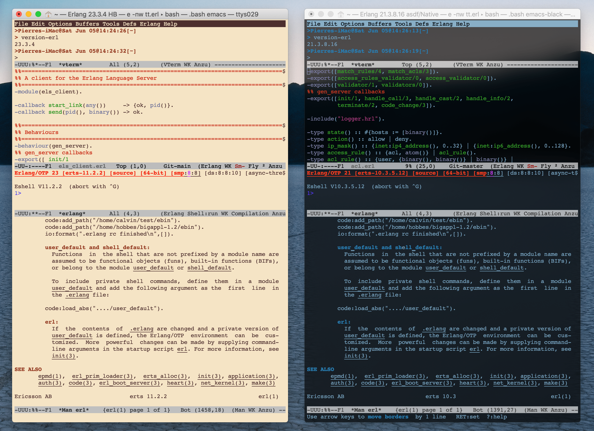

===========================================================
Using PEL with Specialized Shells for Erlang to Edit Erlang
===========================================================

:Home page: https://github.com/pierre-rouleau/about-erlang
:Navigation: Prev_, Top_.
:Project:
:Created:  Saturday, June  5 2021.
:Author:  Pierre Rouleau <prouleau001@gmail.com>
:Modified: 2021-06-05 14:51:05, updated by Pierre Rouleau.
:Copyright: © 2021, Pierre Rouleau

.. _Prev:  specialized-shells.rst
.. _Top:   installing-erlang.rst

.. contents::  **Table of Contents**
.. sectnum::

.. ---------------------------------------------------------------------------

The PEL_ Emacs system extends Emacs takes advantage of Emacs flexible
customization system to provide an easy to customize Emacs system.  With it
you can install or remove external packages by identifying what you need with
Emacs customization system.  It also provides an extensive set of PDF-based
documentation that documents various Emacs features.

The best way to use its PDF documentation is to access the `PEL Topics Index
PDF`_ using a web browser that can render PDF inside a browser window, such as
Firefox.

Setting up PEL to conform to the Specialized OS Shells for Erlang
=================================================================

With PEL you can take advantage of the `Specialized OS Shells for Erlang`_ .
These shells store the absolute path of the directory holding Erlang man pages
inside the value of the **PEL_ERLANG_MAN_PARENT_DIR** environment variable.

You can inform PEL to use that environment variable so that Emacs will be able
to open the man files related to the version of Erlang used by the current OS
shell where Emacs runs.

Open Emacs and access the pel-erlang-environment customization group.  You can
do this in various ways as described at the top of the
`PEL 𝕻𝔩 - Erlang PDF`_.  From outside of an erlang file, you can type on of
those commands:

- ``M-x customize-group pel-erlang-environment RET``, or
- ``<f11> SPC e <f2>`` then select the Pel Erlang Environment link that shows
  at the bottom of the window.

Once in that window select the ``pel-erlang-man-parent-rootdir`` user-option
and set it such that it reads the path from the ``PEL_ERLANG_MAN_PARENT_DIR``
environment variable.  You should see something like the following:

Use the Emacs buttons at the top of the window to save your customization.

From then on, when you open a Erlang man page from within Emacs that is
running inside a specialized shell, the man file selected will correspond to
the version of Erlang selected for the OS specialized shell.

The following screen shot shows two terminal shells that have been specialized
for different versions of Erlang. The one on the left is using Erlang 23.3.4
as installed by Homebrew.   The one on the right is using Erlang 21.3.8.16
installed by asdf-vm using the native compiler on macOS.  Each one show 4
windows:

- A vterm window chowing the result of the command ``version-erl`` that
  displays the version of Erlang available to the shell.
- A Erlang file edited.  This window has the focus, so the Emacs menu at the
  top  of the Emacs frame is for Erlang buffers,
- A window with  the Erlang shell, erl, running.  The first thing this does is
  print version information.
- A window showing the end of the erl man page where you can read their
  corresponding version of Erlang erts.

PEL provides other support for Erlang.

.. _PEL: https://github.com/pierre-rouleau/pel#readme
.. _PEL Topics Index PDF: https://raw.githubusercontent.com/pierre-rouleau/pel/master/doc/pdf/-index.pdf
.. _Specialized OS Shells for Erlang: specialized-shells.rst
.. _PEL 𝕻𝔩 - Erlang PDF: https://raw.githubusercontent.com/pierre-rouleau/pel/master/doc/pdf/pl-erlang.pdf

.. ---------------------------------------------------------------------------

..
       Local Variables:
       time-stamp-line-limit: 10
       time-stamp-start: "^:Modified:[ \t]+\\\\?"
       time-stamp-end:   "\\.$"
       End:
