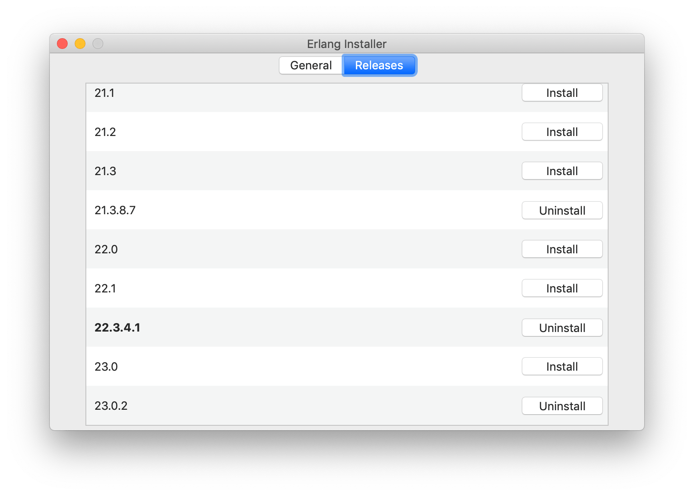
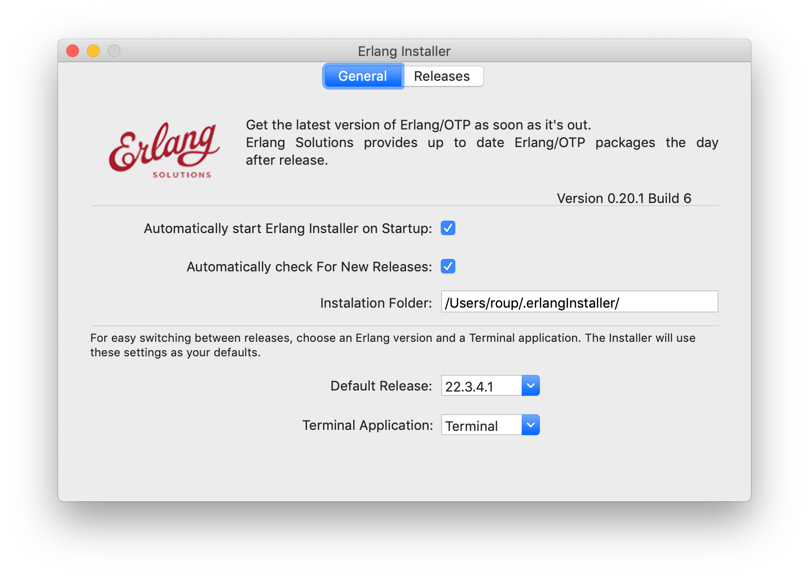

===========================================================
Install Erlang Using Erlang Installer from Erlang Solutions
===========================================================

:Home page: https://github.com/pierre-rouleau/about-erlang
:Time-stamp: <2021-05-15 17:33:29, updated by Pierre Rouleau>
:Copyright:  Copyright © 2020-2021, Pierre Rouleau
:License: `MIT <../LICENSE>`_

.. contents::  **Table of Contents**
.. sectnum::

.. ---------------------------------------------------------------------------

`Erlang Solutions`_ provide a macOS application called the Erlang Installer that allows the
installation of several versions of Erlang on a macOS computer.  You can get
that tool on `Erlang Solution Download page`_.  Select Erlang OTP and the Mac
OS X platform and you should get a link to ErlangInstaller.1.0.2.dmg_ or
something more recent.

With this GUI tool you can install or remove several pre-compiled versions of
Erlang for macOS.  The tool is not always up to date, however.  In the past I
had to contact Erlang Solutions to request updates to the tool so it can
download the latest Erlang versions.  They normally fixed the problem quickly.

With the Preferences dialog of ErlangInstaller, you can select one version you
can use by default, specify the directory where the application stores its
files and identify the application used for launching shells.

When the ErlangInstaller application runs, it show up in macOS menu bar you
can quickly open its Preference dialog to manage Erlang versions and also use
the menu to launch a shell specialized with the default Erlang version or any
of the Erlang versions you have installed.

.. image:: ../res/ei-menu.png

The latest version of this tool installs all versions under the
``~/.erlanginstaller`` root (but that can be changed via the Preference
dialog),
along with a JSON file that contains a list of
available versions and a symlink to the version you identify as a default via
the ErlangInstaller application Preference dialog.

Here's what the top level view of the ``~/.erlanginstaller`` directory looks
like:

.. code:: shell

    > tree -L 1 -A .erlanginstaller
    .erlanginstaller
    ├── 19.3
    ├── 20.3.8
    ├── 21.3.8.7
    ├── 22.3.4.1
    ├── 23.0.2
    ├── available-releases.json
    └── default -> /Users/roup/.erlangInstaller/22.3.4.1

    6 directories, 1 file
    >

Here again, listing only the directories at a depth of 2, with the Erlang
versions I had installed at the time.

.. code:: shell

    >
    > tree -d -L 2 -A .erlanginstaller
    .erlanginstaller
    ├── 19.3
    │   ├── bin
    │   ├── erts-8.3
    │   ├── lib
    │   ├── misc
    │   ├── releases
    │   └── usr
    ├── 20.3.8
    │   ├── bin
    │   ├── erts-9.3.3
    │   ├── lib
    │   ├── misc
    │   ├── releases
    │   └── usr
    ├── 21.3.8.7
    │   ├── bin
    │   ├── erts-10.3.5.5
    │   ├── lib
    │   ├── misc
    │   ├── releases
    │   └── usr
    ├── 22.3.4.1
    │   ├── bin
    │   ├── erts-10.7.2.1
    │   ├── lib
    │   ├── misc
    │   ├── releases
    │   └── usr
    ├── 23.0.2
    │   ├── bin
    │   ├── doc
    │   ├── erts-11.0.2
    │   ├── lib
    │   ├── misc
    │   ├── releases
    │   └── usr
    └── default -> /Users/roup/.erlangInstaller/22.3.4.1

    37 directories
    >

With this application you can install or removed versions of Erlang easily.

Their Erlang implementations work fine but the HTML documentation and the Man pages
are missing.  You must install these files separately.
See the section titled
`Manual installation of Erlang OTP Documentation and Man Files`_ which
describes how to do it.

I use the same strategy as for Homebrew here and I create shell scripts and
alias to activate the various Erlang versions instead of using the Erlang
Installer tool that can launch pre-configured shell with specific version of
Erlang.  The reason I do this is to add access to the Man pages and to setup
other things if I need to.  For example, I'm thinking of setting up my Emacs
environment to be able to access the local HTML documentation of a the
module:function:arity at the cursor location or on request.  For that I need
to identify the location of the root where the files are stored and I do this
with an environment variable that I could set in the script.

For Erlang versions installed with the Erlang Installer from Erlang Solutions
I use the ``-ei`` suffix to the script and alias names.  For example, here's
the alias and the script for Erlang 23.0.2 installed with the tool inside
``~/.erlanginstaller/23.0.2``:

The alias, stored inside ``.bashrc``:

.. code:: bash

    alias use-erlang-23-ei='source envfor-erlang-23-ei'

And the bash script file that is source by it, stored in a directory that is
on my system's path:

.. code:: bash

    #!/usr/bin/env bash
    # Abstract: Complete Erlang Solutions' Erlang Installer 23.0.2
    # Last Modified Time-stamp: <2020-07-02 19:18:12, updated by Pierre Rouleau>
    # -----------------------------------------------------------------------------
    # This file *must* be sourced.
    #
    # Run with: use-erlang-23-ei

    # -----------------------------------------------------------------------------
    if [ "$DIR_ERLANG_DEV" == "" ]; then
        export DIR_ERLANG_DEV="$HOME/dev/erlang"
        PATH=$HOME/.erlangInstaller/23.0.2/lib/erl_interface-4.0/bin:$HOME/.erlangInstaller/23.0.2/bin:${PATH}
        export PATH
        MANPATH=$HOME/docs/Erlang/otp-23.0/man/man:`manpath`
        export MANPATH
        echo "+ Erlang 23.0.2 (from Erlang Solutions Erlang Installer) environment set."
        echo "+ Using OTP-23.0 Man pages."
        settitle "Erlang 23.0.2 EI"
    else
        echo "! Erlang environment was already set for this shell: nothing done this time."
    fi

    # -----------------------------------------------------------------------------

To use this, I start a new shell and I issue the ``use-erlang-23-ei`` command:

.. code:: shell

    > use-erlang-23-ei
    + Erlang 23.0.2 (from Erlang Solutions Erlang Installer) environment set.
    + Using OTP-23.0 Man pages.
    > version-erl
    23.0.2
    > which erl
    /Users/roup/.erlangInstaller/23.0.2/bin/erl
    > man -w erl
    /Users/roup/docs/Erlang/otp-23.0/man/man/man1/erl.1
    > man -w lists
    /Users/roup/docs/Erlang/otp-23.0/man/man/man3/lists.3
    > erl
    Erlang/OTP 23 [erts-11.0.2] [source] [64-bit] [smp:8:8] [ds:8:8:10] [async-threads:1]

    Eshell V11.0.2  (abort with ^G)
    1> q().
    ok
    2>
    >
    >

.. _Erlang Solutions: https://www.erlang-solutions.com
.. _ErlangInstaller:
.. _Erlang Solution Download page: https://www.erlang-solutions.com/resources/download.html
.. _ErlangInstaller.1.0.2.dmg: https://packages.erlang-solutions.com/os-x-installer/ErlangInstaller1.0.2.dmg
.. _Erlang/OTP download: https://www.erlang.org/downloads

.. ---------------------------------------------------------------------------
