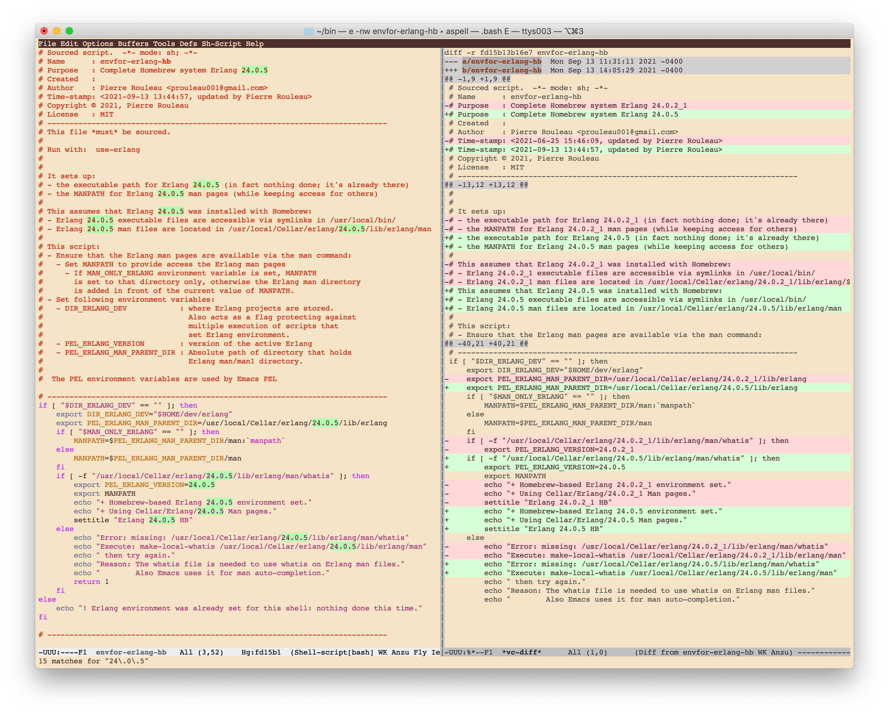
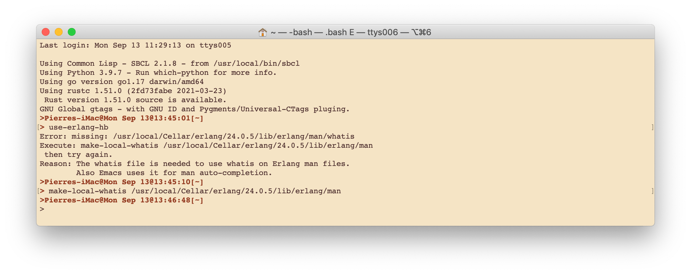
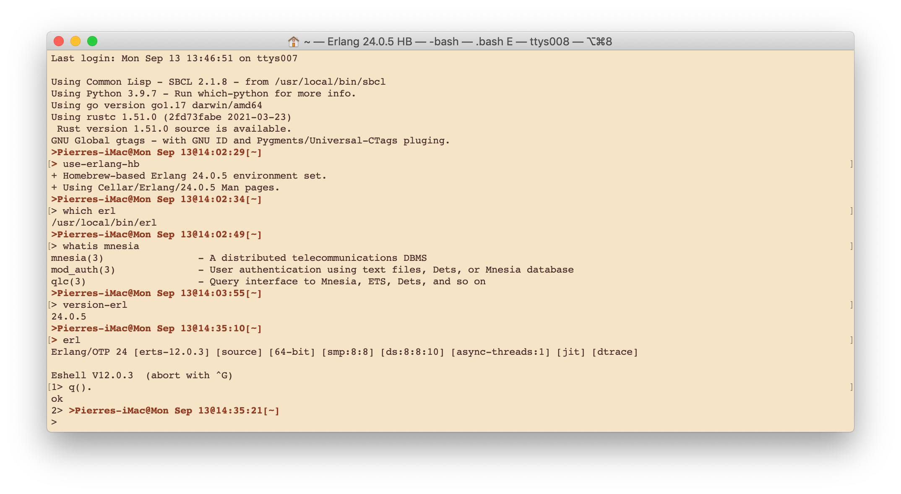

===============================
Installing Erlang with Homebrew
===============================

:Home page: https://github.com/pierre-rouleau/about-erlang
:Navigation: Top_, Next_
:Time-stamp: <2021-09-13 14:33:43, updated by Pierre Rouleau>
:Copyright:  Copyright © 2020-2021, Pierre Rouleau
:License: `MIT <../LICENSE>`_

.. _Top:   installing-erlang.rst
.. _Next:  installing-erlang-ei.rst

.. contents::  **Table of Contents**
.. sectnum::

.. ---------------------------------------------------------------------------

Homebrew_ is a popular package manager for macOS (and now also for Linux).
You can install Erlang with it.  But be aware of the following pros and cons:

- **Pros**:

  - It is very easy to install Erlang with Homebrew. See the
    instructions below.

- **Cons**:

  - Homebrew installs a version that it will eventually want to
    upgrade. It is fine when just experimenting with Erlang but this will not help
    you if you want to create a system that will be running for a long time.

    - It's possible to prevent homebrew from upgrading it by using the ``brew pin
      erlang`` command though.  See `Homebrew FAQ`_ if you want to do that.
    - If Homebrew upgrades Erlang to a new version, and you use a script
      similar to the example `envfor-erlang-hb`_ below, you will have to:

      - update the script to specify the new Erlang version path, and
      - run the ``make-local-whatis`` utility to create the whatis file.
      - See an example below in the section titled `Updating Homebrew Erlang Environment`_.

Installation Instructions
=========================

Install Homebrew
----------------

- If you don't already have it, install the Homebrew command line utility
  (``brew``) using the instructions right on the `Homebrew home page`_.
- You can then use the various commands:

  - ``brew search`` to search for a package.  For Erlang: ``brew search
    erlang`` will do.
  - ``brew info`` to get more info about a package. Something like ``brew info
    erlang``.  This will describe the version and its dependencies.
  - ``brew update`` fetches the latest version of Homebrew and all its
    formulas and performs any necessary migration of already installed
    packages.
  - ``brew upgrade`` upgrades outdated packages.
  - ``brew doctor`` checks Homebrew installation and your system for potential
    problems.
  - ``brew install`` to install a given package.  To install Erlang with
    Homebrew, the command is: ``brew install erlang``.

Once Homebrew is installed you can use the ``man brew`` command to open
Homebrew man page for more information.

Note:
  If you encounter Homebrew specific problems, the best place to get help is the
  `Homebrew/discussions on GitHub`_.  Search for something similar, otherwise start
  a new discussion asking for help.

Check what Homebrew Installs
----------------------------

First check what version of Erlang will be installed by Homebrew: use the
``brew search erlang`` and ``brew info erlang`` commands.

.. code:: shell

    > brew search erlang
    ==> Formulae
    erlang ✔                   erlang@20                  erlang@21                  erlang@22
    > brew info erlang
    erlang: stable 23.0.2 (bottled), HEAD
    Programming language for highly scalable real-time systems
    https://www.erlang.org/
    /usr/local/Cellar/erlang/22.3.4 (5,790 files, 282MB) *
      Poured from bottle on 2020-05-12 at 14:53:10
    From: https://github.com/Homebrew/homebrew-core/blob/HEAD/Formula/erlang.rb
    ==> Dependencies
    Build: autoconf ✔, automake ✔, libtool ✘
    Required: openssl@1.1 ✔, wxmac ✘
    ==> Options
    --HEAD
            Install HEAD version
    ==> Caveats
    Man pages can be found in:
      /usr/local/opt/erlang/lib/erlang/man

    Access them with `erl -man`, or add this directory to MANPATH.
    >

Install Erlang with Homebrew
----------------------------

To install, you should update and upgrade Homebrew, then install Erlang with
the following 3 consecutive commands::

    brew update
    brew upgrade
    brew install erlang

On a macOS system, if all went well Homebrew should have installed Erlang
binaries somewhere under ``/usr/local/Cellar`` and placed symlinks inside
``/usr/local/bin``.

Make sure ``/usr/local/bin`` is in your PATH.

Then if you execute ``which erl`` you should get something like
``/usr/local/bin/erl``.

Once it's done you should be able to run the Erlang REPL and the compiler
in your main shell.

A little more work is required to also be able to open the Erlang Man files.

Complete shell setup with access to Erlang Man files
----------------------------------------------------

On my systems I like to be able to have quick commands to setup and modify
shell environments.  They also help me document the settings.
To do that I use the following:

- A shell script that:

  - sets up environment variables such as ``PATH``, ``MANPATH``, etc...
  - prints information about what is being set up,
  - set a title for the shell, so I can quickly identify the terminal window,
  - and whatever is required to set up the programming environment.

  That script must be sourced.  I put the script in ``~/bin`` which is on my
  ``PATH``.  The execute bit of the script file is not set, preventing the
  script from being invoked directly.   The names for these scripts all start
  with the ``envfor-`` prefix.  For Erlang they're ``envfor-erlang-``.

  - For the Homebrew installation of Erlang, the script is
    ``~/bin/envfor-erlang-hb``.  There's only one since you will normally have
    only one Erlang version controlled by Homebrew.

- A shell command alias set up in ``~/.bashrc`` that refers to the script in
  ``~/bin``.  These aliases all have a name that starts with the ``use-``
  prefix.  For Erlang, they are named ``use-erlang-`` something.  For the
  Homebrew installation of Erlang the alias is ``use-erlang-hg``.

See the example code below.

Example Scripts - Complete Erlang 23.3.4 installation
~~~~~~~~~~~~~~~~~~~~~~~~~~~~~~~~~~~~~~~~~~~~~~~~~~~~~

envfor-erlang-hb
^^^^^^^^^^^^^^^^

Here's the script:

.. code:: bash

    # Sourced script.  -*- mode: sh; -*-
    # Name      : envfor-erlang-hb
    # Purpose   : Complete Homebrew system Erlang 23.3.4
    # Created   :
    # Author    : Pierre Rouleau <prouleau001@gmail.com>
    # Time-stamp: <2021-06-04 15:44:32, updated by Pierre Rouleau>
    # Copyright © 2021, Pierre Rouleau
    # License   : MIT
    # -----------------------------------------------------------------------------
    # This file *must* be sourced.
    #
    # Run with:  use-erlang
    #
    #
    # It sets up:
    # - the executable path for Erlang 23.3.4 (in fact nothing done; it's already there)
    # - the MANPATH for Erlang 23.3.4 man pages (while keeping access for others)
    #
    # This assumes that Erlang 23.3.4 was installed with Homebrew:
    # - Erlang 23.3.4 executable files are accessible via symlinks in /usr/local/bin/
    # - Erlang 23.3.4 man files are located in /usr/local/Cellar/erlang/23.3.4/lib/erlang/man
    #
    # This script:
    # - Ensure that the Erlang man pages are available via the man command:
    #   - Set MANPATH to provide access the Erlang man pages
    #     - If MAN_ONLY_ERLANG environment variable is set, MANPATH
    #       is set to that directory only, otherwise the Erlang man directory
    #       is added in front of the current value of MANPATH.
    # - Set following environment variables:
    #   - DIR_ERLANG_DEV            : where Erlang projects are stored.
    #                                 Also acts as a flag protecting against
    #                                 multiple execution of scripts that
    #                                 set Erlang environment.
    #   - PEL_ERLANG_VERSION        : version of the active Erlang
    #   - PEL_ERLANG_MAN_PARENT_DIR : Absolute path of directory that holds
    #                                 Erlang man/man1 directory.
    #
    #  The PEL environment variables are used by Emacs PEL

    # -----------------------------------------------------------------------------
    if [ "$DIR_ERLANG_DEV" == "" ]; then
        export DIR_ERLANG_DEV="$HOME/dev/erlang"
        export PEL_ERLANG_MAN_PARENT_DIR=/usr/local/Cellar/erlang/23.3.4/lib/erlang
        if [ "$MAN_ONLY_ERLANG" == "" ]; then
            MANPATH=$PEL_ERLANG_MAN_PARENT_DIR/man:`manpath`
        else
            MANPATH=$PEL_ERLANG_MAN_PARENT_DIR/man
        fi
        if [ -f "/usr/local/Cellar/erlang/23.3.4/lib/erlang/man/whatis" ]; then
            export PEL_ERLANG_VERSION=23.3.4
            export MANPATH
            echo "+ Homebrew-based Erlang 23.3.4 environment set."
            echo "+ Using Cellar/Erlang/23.3.4 Man pages."
            settitle "Erlang 23.3.4 HB"
        else
            echo "Error: missing: /usr/local/Cellar/erlang/23.3.4/lib/erlang/man/whatis"
            echo "Execute: make-local-whatis /usr/local/Cellar/erlang/23.3.4/lib/erlang/man"
            echo " then try again."
            echo "Reason: The whatis file is needed to use whatis on Erlang man files."
            echo "        Also Emacs uses it for man auto-completion."
            return 1
        fi
    else
        echo "! Erlang environment was already set for this shell: nothing done this time."
    fi

    # -----------------------------------------------------------------------------

It uses:

- the `make-local-whatis script`_ to create `whatis files for Erlang`_ when
  they are missing.
- the `settitle script`_ to set the title of the macOS terminal window; it
  helps quickly identify the terminal window when you have several terminal
  windows opened.

The .bashrc use-erlang-hb alias
-------------------------------

The ``.bashrc`` file holds the alias:

.. code:: bash

   alias use-erlang='source envfor-erlang-23.3.4'

Updating Homebrew Erlang Environment
------------------------------------

If you upgrade Homebrew's version of Erlang, and use the scripts described in
the above sections, then you have to update the ``envfor-erlang-hb`` script to
identify the new version of Erlang.

Here's a session where the Homebrew version of Erlang identified by
the script is invalid because Homebrew upgraded Erlang.

Originally the Homebrew version of Erlang was 24.0.2_1.  Homebrew upgraded
Erlang to 24.0.5. If I open a shell and issue the ``use-erlang-hb`` command it
issues an error not finding the whatis library for Erlang.

.. code:: bash

    > use-erlang-hb
    Error: missing: /usr/local/Cellar/erlang/24.0.2_1/lib/erlang/man/whatis
    Execute: make-local-whatis /usr/local/Cellar/erlang/24.0.2_1/lib/erlang/man
     then try again.
    Reason: The whatis file is needed to use whatis on Erlang man files.
            Also Emacs uses it for man auto-completion.

The solution is to edit the script.  Here's a snapshot showing the file edited
with Emacs and PEL_:  On the left hand side window the file is edited using
iedit_ to change the 15 instances of the Erlang version number at once.  On the
right hand side window we can see the diff between the old version of the file
and the new one.

With the file saved, I open a new shell and issue the ``user-erlang-hb``
command again.  It tells me that the whatis files is missing but the version
is correct.  I issue the ``make-local-whatis`` command.

Now I can open another shell and run the command again.  The script succeeds
identifying Erlang version and the Erlang Man pages.  I can get whatis
information about mnesia.

.. _PEL:    https://github.com/pierre-rouleau/pel#readme
.. _iedit:  https://github.com/victorhge/iedit#readme

Starting a new Erlang session
=============================

To use it I start a new Bash shell and type ``use-erlang``, as shown here:

.. code:: bash

    > use-erlang-hb
    + Homebrew-based Erlang 23.3.4 environment set.
    + Using Cellar/Erlang/23.3.4 Man pages.
    > echo $MANPATH
    /usr/local/Cellar/erlang/23.3.4/lib/erlang/man:/usr/local/share/man:/usr/share/man:/opt/X11/share/man:/Library/Developer/CommandLineTools/SDKs/MacOSX.sdk/usr/share/man:/Applications/Xcode.app/Contents/Developer/usr/share/man:/Applications/Xcode.app/Contents/Developer/Toolchains/XcodeDefault.xctoolchain/usr/share/man
    > man man
    > man -w erl
    /usr/local/Cellar/erlang/23.3.4/lib/erlang/man/man1/erl.1
    > man -w lists
    /usr/local/Cellar/erlang/23.3.4/lib/erlang/man/man3/lists.3
    > version-erl
    23.3.4
    >

The version-erl_ is another script I wrote to display the version of the Erlang
system available in the shell.  It runs Erlang code from the command line.

.. ---------------------------------------------------------------------------

.. _Homebrew home page:
.. _Homebrew: https://brew.sh
.. _Homebrew/discussions on GitHub: https://github.com/Homebrew/discussions/discussions
.. _Homebrew FAQ:  https://docs.brew.sh/FAQ
.. _make-local-whatis script: whatis-files.rst#the-make-local-whatis-script
.. _whatis files for Erlang:  whatis-files.rst#the-whatis-utility
.. _settitle script:          settitle.rst
.. _version-erl:              version-erl.rst#the-version-erl-executable-script

.. ---------------------------------------------------------------------------
